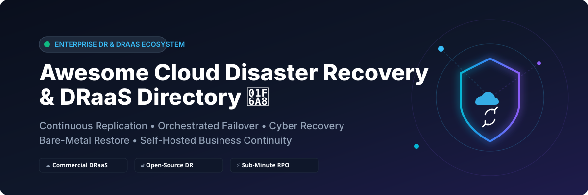

# Awesome-Cloud-Disaster-Recovery-DRaaS

# Awesome-Cloud-Disaster-Recovery-DRaaS 🚨 ☁️



  





  
  
  
  
  
  



---

## 🌟 Top Cloud Disaster Recovery (DRaaS) Ecosystem

**Curated List of Commercial DRaaS Platforms & Open-Source Recovery Frameworks**  
*Focused on Continuous Replication, Orchestrated Failover, Cyber Recovery, Bare-Metal Restore & Self-Hosted Business Continuity*  

**Last updated: October 2026** 📅

---

### 📌 Overview & SEO Summary
Welcome to the ultimate curated directory of **cloud disaster recovery platforms**, **open-source backup and recovery frameworks**, and **business continuity automation tools**. Whether you are looking for enterprise-grade commercial solutions (such as *AWS Elastic Disaster Recovery*, *Zerto*, and *Azure Site Recovery*), or self-hostable open-source alternatives (like *ReaR* and *Bacula*), this list covers category leaders, continuous data protection, and privacy-respecting recovery orchestration.

---

## 📑 Table of Contents
- [🏢 SaaS & Commercial Platforms](#-saas--commercial-platforms)
- [🔓 Open-Source GitHub Projects](#-open-source-github-projects)
- [🛠️ How to Contribute](#%EF%B8%8F-how-to-contribute)
- [📊 Star History](#-star-history)
- [🤝 Support & Sponsorship](#-support--sponsorship)
- [⚠️ Disclaimer](#%EF%B8%8F-disclaimer)

---

## 🏢 SaaS / Commercial Platforms

The DRaaS market spans **cloud-native replication services** (AWS Elastic Disaster Recovery, Azure Site Recovery) that integrate deeply with their respective ecosystems, and **specialized orchestration platforms** (Zerto, Veeam, Commvault) that provide continuous data protection with low RPOs and one-click failover. **AWS Elastic Disaster Recovery** provides **continuous block-level replication** to AWS with **RPOs of seconds and RTOs of minutes**, using affordable staging area storage . **Zerto** pioneered **Continuous Data Protection (CDP)** with **journal-based recovery**, enabling recovery to any point in time with minimal data loss . **Azure Site Recovery** supports **application-consistent snapshots** and **recovery plans** for multi-tier applications, including SQL Server Always On and SharePoint . **Veeam Disaster Recovery Orchestrator** extends Veeam Backup & Replication with **one-click orchestration plans**, automated testing, and compliance reporting . **Druva Cloud DR** is **VMware-only**, replicating backed-up VMs to AWS for on-demand recovery, with **no physical machine support** . **Rubrik Cyber Recovery** focuses on **Azure VM recovery** with **integrated threat hunting**, **Anomaly Detection**, and **Turbo Threat Hunting** scanning **75,000 backups in 60 seconds** . **Datto SIRIS** uses **Inverse Chain Technology** where **every backup is a bootable recovery point**, with **AI-powered screenshot verification** for backup integrity . **Commvault Autonomous Recovery** provides **sub-minute RPOs and near-zero RTOs** with **isolated post-event forensic analysis** and **automated failover/failback** . **Acronis Cyber Protect** automates cloud network infrastructure creation for DR, requiring **full machine or boot-disk backup** to cloud storage . **Carbonite Recover** replicates on a **byte level in real time**, with **RTOs in minutes** and **RPOs in seconds** .

| SaaS / Commercial Platform | Company / Owner | Valuation / Market Cap | Standard Edition Starting Price | Free Tier / Free Trial Limits | Description |
| :--- | :--- | :--- | :--- | :--- | :--- |
| **[AWS Elastic Disaster Recovery](https://aws.amazon.com/disaster-recovery/)** ☁️ | Amazon | ~$2.0 Trillion | **Pay-as-you-go** for staging area and recovery instances | **Free tier: 2,160 hours of DRS for 90 days** (new accounts) | **AWS-native DR** — **Continuous block-level replication** with **RPOs of seconds, RTOs of minutes**. Affordable staging area, point-in-time recovery, unified test/recover/failback process. Supports on-premises and cloud-based applications . |
| **[Zerto](https://www.zerto.com/)** 🎯 | HPE (Acquired) | ~$60 Billion (HPE) | Custom enterprise pricing | **Demo available** | **Continuous Data Protection (CDP)** — **Journal-based recovery** to any point in time with **RPOs of seconds**. **On-Demand Sandbox** for non-disruptive testing. **Orchestration and automation** for site-wide, application, VM, folder, and file recovery in a few clicks . |
| **[Azure Site Recovery](https://azure.microsoft.com/en-us/products/site-recovery/)** 🔷 | Microsoft | ~$3.90 Trillion | **Pay-as-you-go** for replication and storage | **Free tier: 31 days of replication for 1 VM** | **Azure-native DR** — **Application-consistent snapshots** capture disk, memory, and transactions. **Recovery plans** for multi-tier applications including SQL Always On, SharePoint, Exchange. **Shared disk support** for WSFC workloads . |
| **[Veeam Disaster Recovery Orchestrator](https://www.veeam.com/)** 🟢 | Veeam Software | ~$5 Billion | Custom enterprise pricing | **Free trial available** | **Orchestration on Veeam Data Platform** — **One-click orchestration plans** for critical applications. **Isolated test labs** and **readiness checks**. **Compliance reporting** with RPO/RTO achievement dashboards. Recover to VMware vSphere and Microsoft Azure . |
| **[Druva Cloud DR](https://www.druva.com/)** 📊 | Druva | Private | Custom per-TB pricing | **Free trial available** | **SaaS-based DR for VMware** — **VMware-only** (no physical machines) . Replicates backed-up VMs to **AWS for on-demand recovery**. **Pre-configured failover settings** (VPC, subnet, security groups, IP assignment) make actual failover **one-click** . |
| **[Rubrik Orchestrated Recovery](https://www.rubrik.com/)** 🟣 | Rubrik | ~$6 Billion | Custom enterprise pricing | **Demo available** | **Cyber recovery for Azure VMs** — **Anomaly Detection** for ransomware blast radius. **Turbo Threat Hunting** scans 75,000 backups in 60 seconds. **Recovery plans** with boot order priorities and destination networks. **Lock Recovery** prevents changes during active recovery . |
| **[Datto SIRIS](https://www.kaseya.com/products/bcdr/)** 🟡 | Kaseya | Private | **All-in-one hardware + software + cloud** pricing | **No free tier**; demo available | **BCDR for SMB and MSPs** — **Every backup is a bootable recovery point** via Inverse Chain Technology. **AI-powered screenshot verification** for backup integrity. **Hardened Linux appliances** outside Windows attack surface. **One-click DR** to Datto Cloud or local hardware . |
| **[Commvault Autonomous Recovery](https://www.commvault.com/)** 🏢 | Commvault | ~$4 Billion (Public) | Custom enterprise pricing | **Free trial available** | **AI-driven automated DR** — **Sub-minute RPOs and near-zero RTOs**. **Isolated post-event forensic analysis** for suspicious files. **Automated failover and failback**. **3-5x better TCO** than other recovery solutions. **Air Gap** and **Cleanroom** add-ons available . |
| **[Acronis Cyber Protect](https://www.acronis.com/)** 🔵 | Acronis | Private | Custom per-workload pricing | **Free trial available** | **Backup + cybersecurity + DR** — **Automated cloud network infrastructure** creation when DR plan is applied. Requires **full machine or boot-disk backup** to cloud storage. **Test or production failover** from any recovery point generated after DR protection . |
| **[Carbonite Recover](https://www.carbonite.com/)** 📡 | OpenText (Carbonite) | ~$10 Billion (OpenText) | Custom per-server pricing | **Free trial available** | **DRaaS for critical systems** — **Real-time byte-level replication** to cloud. **RTOs in minutes, RPOs in seconds**. **Orchestration, boot order, and failover scripting** for multi-tier applications. **Bandwidth optimization** limits network impact . |

---

## 🔓 Open-Source GitHub Projects

*Sorted by GitHub_Stars_Count (Descending)* 🌟

- **[ReaR (Relax-and-Recover)](https://github.com/rear/rear)**   
  **Bare metal disaster recovery and system migration framework**, GPL-3.0 licensed. **Debian package `rear` (2.7+dfsg-1.2)** available for **armhf, amd64, and other architectures** . **Creates a bootable rescue image** of your system — when disaster strikes, boot from the image and restore to bare metal. **Hardware-agnostic** — restore to different hardware than the original system. **Supports Linux, PPC64, and ia64**. **Integrates with backup tools** like Bacula, Borg, and rsync for data restoration. **The standard open-source bare-metal recovery solution** for Linux systems. 🏗️

- **[Bacula](https://github.com/bacula/bacula)**   
  **Open-source network backup and recovery system**, AGPL-3.0 licensed. **One of the largest open-source backup projects worldwide**. **Disaster recovery for Win32 systems** requires **NTBackup** for system state capture plus Bacula for user files, then reload base OS and restore . **BartPE rescue CD plugin** available for **Windows XP SP1** bare-metal restore — boot from CD, start networking, start Bacula client, and restore via console. **The most widely deployed open-source enterprise backup platform**. 💾

- **[UrBackup](https://github.com/uroni/urbackup-server)**   
  **Client/server backup system with image and file backups**, AGPL-3.0 licensed. **VHD(Z) image backups** for bare-metal restore on Linux and Windows. **Mount VHD files directly** on Linux via FUSE or Windows via Disk Management for **read-only recovery access** . **Network ports**: 55413 (FastCGI), 55414 (HTTP), 55415 (Internet clients), 35621–35623 (client communication). **The simplest open-source image backup solution** for Windows and Linux fleets. 🛠️

- **[repmgr](https://github.com/2ndQuadrant/repmgr)**   
  **Replication Manager for PostgreSQL**, GPL-3.0 licensed. **Manages replication and failover within a PostgreSQL cluster**. **Sets up standby servers, monitors replication, and performs administrative tasks** like failover or switchover . **Supports PostgreSQL 10, 9.6, 9.5** (9.4 and 9.3 with restrictions). **BDR 2.0 monitoring** for two-node clusters. **The standard open-source DR tool for PostgreSQL high availability**. 🐘

---

## 🛠️ How to Contribute

Contributions are welcome! Follow these steps to submit new DRaaS platforms or open-source recovery software:

1. 🍴 **Fork** the repository.
2. 📝 **Add/edit** entries in `README.md` maintaining table/list structure and formatting.
3. 🔗 Include project title, official website/GitHub link, exact Stars_Count, license, and brief description.
4. 🚀 Submit a **Pull Request** with a descriptive summary of your changes.

---

## 📊 Star History



---

## 🤝 Support & Sponsorship

If you find this cloud disaster recovery repository useful, please consider supporting the project:

- ⭐ **Star** this repository to increase visibility!
- 🔀 **Fork** and share with fellow DR engineers, infrastructure architects, and open-source advocates.
- ☕ **Sponsor & Buy Me a Coffee**: Support ongoing open-source curation via the [GitHub Sponsor Dashboard](https://github.com/sponsors/ishandutta2007).

---

## ⚠️ Disclaimer

- This is a **community-curated** list — not exhaustive and not an endorsement. ℹ️
- **DRaaS is not just backup** — recovery requires **orchestration, testing, and validation**. Veeam Orchestrator provides **readiness checks** and **compliance reporting** , while Zerto's **On-Demand Sandbox** enables **non-disruptive testing** in **four steps** . **Untested DR plans are liabilities, not assets**.
- **Druva Cloud DR is VMware-only** — **no physical machine support**, and replication stays in the **same AWS region as the backup** unless you configure cross-region failover . **Check your RTO/RPO requirements against this limitation**.
- **Rubrik Cyber Recovery for Azure** uses **Anomaly Detection** and **Turbo Threat Hunting** to find clean recovery points — **75,000 backups scanned in 60 seconds** . **Integrated threat hunting is essential for cyber recovery** — traditional backup tools lack native detection.
- **Open-source tools (ReaR, Bacula, UrBackup, repmgr) are excellent for specific use cases** — ReaR for Linux bare metal, Bacula for network backup, repmgr for PostgreSQL HA — but **none provide enterprise-grade orchestration, automated testing, or compliance reporting** out of the box. **Pair them with custom automation** or accept manual processes.
- **Always validate DR plans with real failover tests** — not tabletop exercises. **Recovery time objectives (RTOs) and recovery point objectives (RPOs) are meaningless without verification**. 🚨

---



  <b>Made with ❤️ for DR engineers, infrastructure architects, and open-source business continuity advocates.</b>

